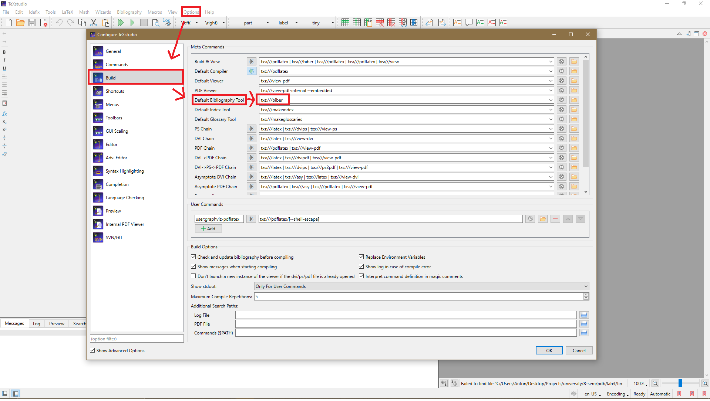
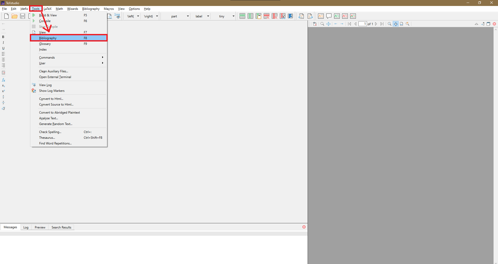

# Популярные проблемы с шаблоном Пархоменко и способы их решения

Все варианты решения затруднений с [шаблоном Пархоменко](https://github.com/ParkhomenkoV/SPbPU-student-thesis-template) представлены на базе программы [TeXstudio](https://www.texstudio.org/) на Windows 10.

## Не создается список литературы

1. В верхней панели открыть "Options" > "Build" и выбрать в разделе "Meta Commands" > "Default Bibliography Tool" значение "Biber", чтобы настроить компилятор списка литературы.

2. В верхней панели нажать "Tools" > "Bibliography", чтобы сгенерировать новый список литературы.

3. Перезапустить несколько раз проект через "Build & View".

Замечания:

* Возможно, что в списке литературы каждая ячейка будет ссылаться на нулевой элемент. В таком случае запускаем "Build & View", пока всё не заработает.

* Иногда нумерация сбивается (например, на первой странице содержание идет ссылка на объект с номером 100, а на последний - 30, что не логично, т.к. ожидаются объекты в порядке их появления: 1, 2, 3 и т.д.). В таком случае нужно почистить кеш TeXstudio до тех пор, пока всё не заработает, как надо.